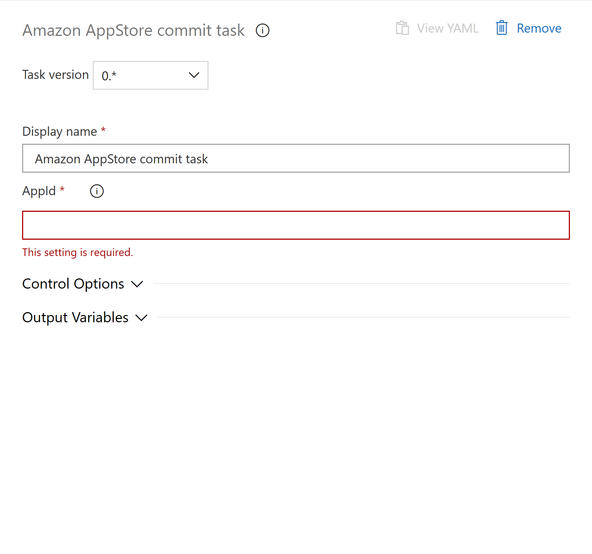

This extension allow you to commit the current update to the Amazon AppStore. The [Prepare call to Amazon AppStore API](https://marketplace.visualstudio.com/items?itemName=MaxenceRaoux.amazon-app-store-prepare) need to be execute before this task to made an authentification and create/get the update edit.

Available tasks: 

- [Prepare task](https://marketplace.visualstudio.com/items?itemName=MaxenceRaoux.amazon-app-store-prepare)
- [Edit task](https://marketplace.visualstudio.com/items?itemName=MaxenceRaoux.amazon-app-store-edit)
- [Replace apk task](https://marketplace.visualstudio.com/items?itemName=MaxenceRaoux.amazon-app-store-replace-apk)
- [Commit task](https://marketplace.visualstudio.com/items?itemName=MaxenceRaoux.amazon-app-store-commit)

# Get started 

[GitHub project readme](https://github.com/Maouxi/amazon-store-api-azure-devops-pipeline-extensions)

# Task input
- appId: The package name or app identifier for the app

# Screenshot

