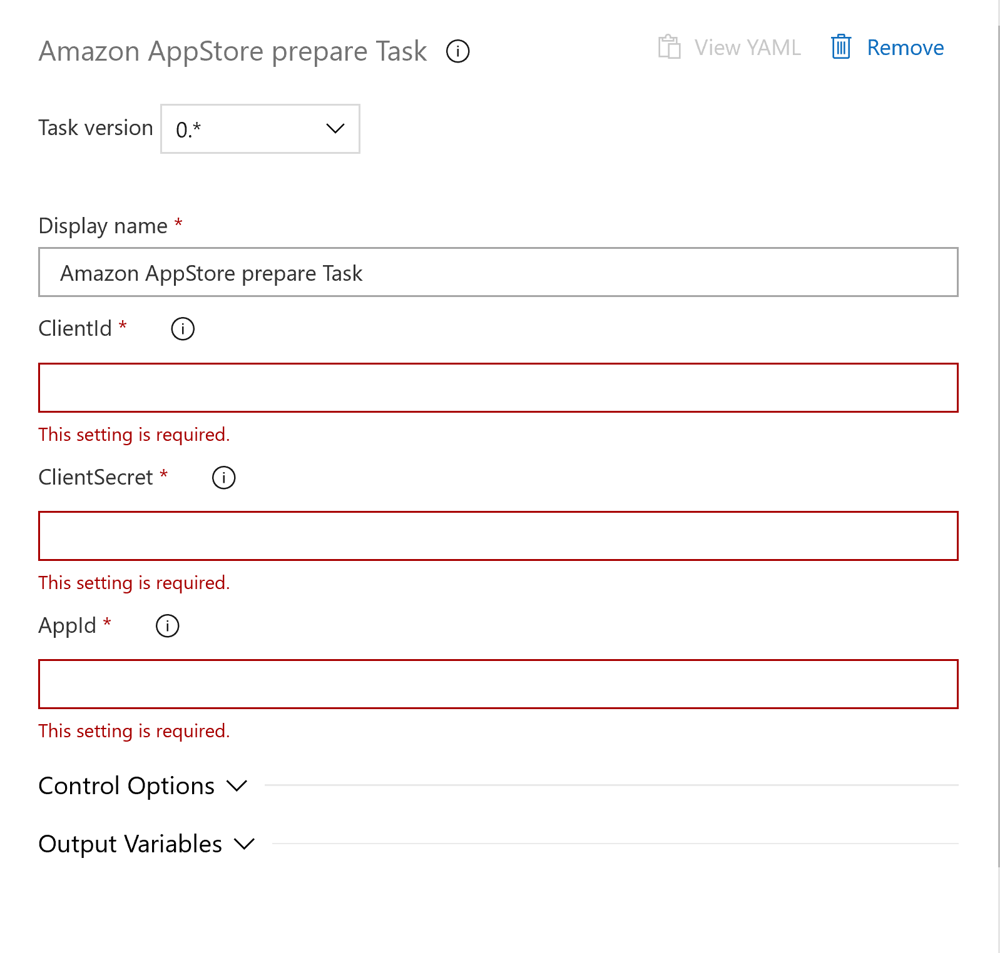

This extension allow you to prepare an Amazon AppStore app publish. It provide an authentication to the Amazon submission API and preapre the publication by create or retriving the current update edit. 

Available tasks: 

- [Prepare task](https://marketplace.visualstudio.com/items?itemName=MaxenceRaoux.amazon-app-store-prepare)
- [Edit task](https://marketplace.visualstudio.com/items?itemName=MaxenceRaoux.amazon-app-store-edit)
- [Replace apk task](https://marketplace.visualstudio.com/items?itemName=MaxenceRaoux.amazon-app-store-replace-apk)
- [Commit task](https://marketplace.visualstudio.com/items?itemName=MaxenceRaoux.amazon-app-store-commit)

# Get started 

[GitHub project readme](https://github.com/Maouxi/amazon-store-api-azure-devops-pipeline-extensions)

# Task inputs

- clientId*: Amazon submission API client id
- clientSecret*: Amazon submission API client secret
- appId*: The package name or app identifier for the app

# Task outputs

- AmazonAccessToken : Amazon submission API access token. Can be retrieve in any other tasks as a variable. `$(AmazonAppStorePrepareTask.AmazonAccessToken)`.
- AmazonEditId : Amazon AppStore editId. Can be retrieve in any other tasks as a variable. `$(AmazonAppStorePrepareTask.AmazonEditId)`.

# Screenshot

